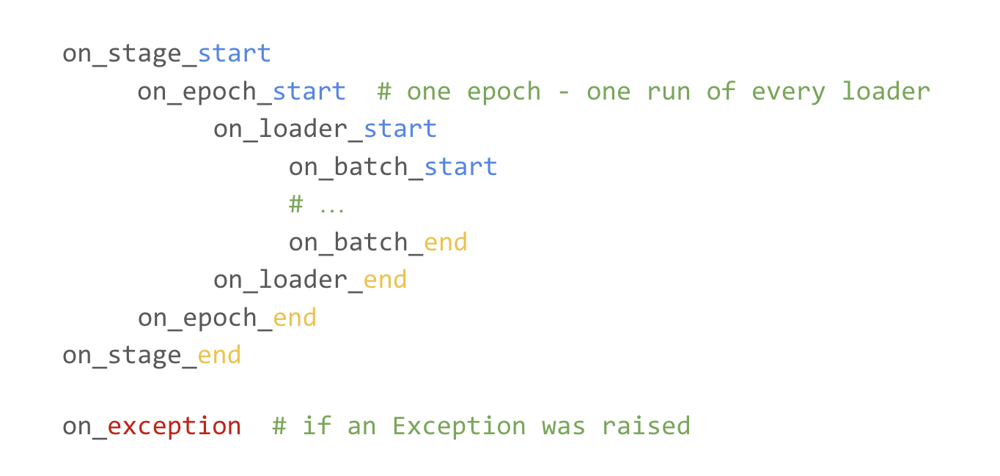
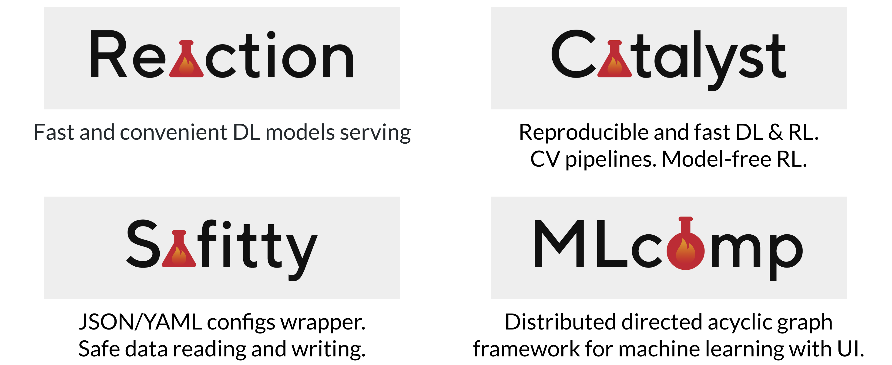
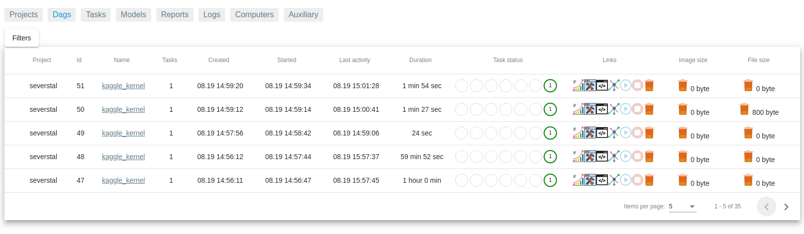
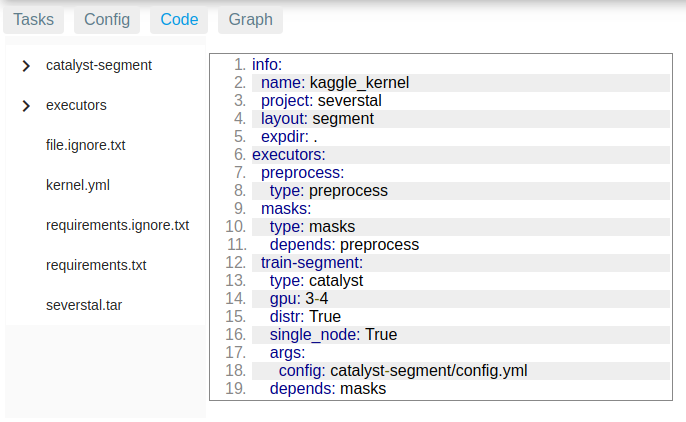
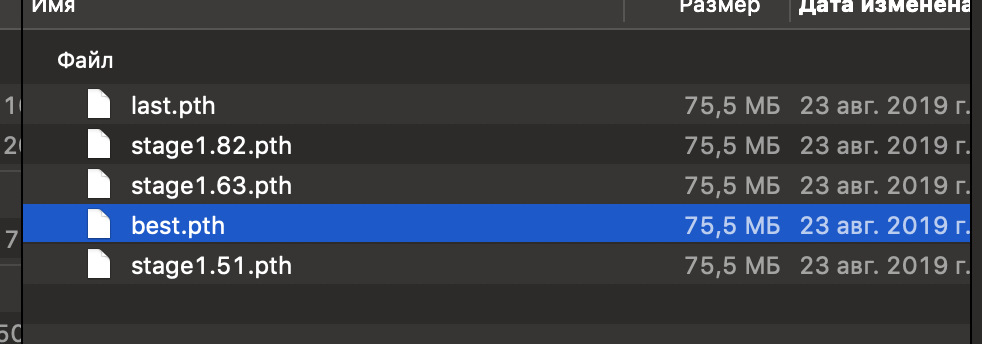
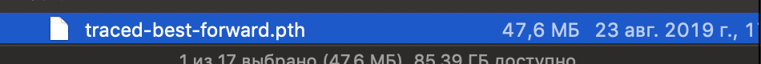
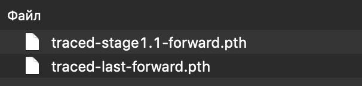

<div align="center">

[](https://github.com/catalyst-team/catalyst)

**Catalyst info**
 
[](https://pypi.org/project/catalyst/)
[](https://catalyst-team.github.io/catalyst/index.html)
[](https://pepy.tech/project/catalyst)
[](LICENSE)

[](https://travis-ci.com/catalyst-team/catalyst)
[](https://t.me/catalyst_team)
[](https://gitter.im/catalyst-team/community?utm_source=badge&utm_medium=badge&utm_campaign=pr-badge)
[](https://opendatascience.slack.com/messages/CGK4KQBHD)
[](https://www.patreon.com/catalyst_team)

**Catalyst-info** is a series of posts about [Catalyst library](https://github.com/catalyst-team/catalyst) development and its [ecosystem](https://github.com/catalyst-team).

</div>

You can suggest a topic for the next release via [telegram](https://t.me/catalyst_team), [gitter](https://gitter.im/catalyst-team/community) or in [issues](https://github.com/catalyst-team/catalyst-info/issues) to this repository 😉

Check also our maintained [Awesome list](https://github.com/catalyst-team/awesome-catalyst-list)

## Contents
* **[#5 Callbacks](#catalyst-info-5-callbacks)**
* **[#4. Ecosystem](#catalyst-info-4-ecosystem)**
* **[#3. Runners](#catalyst-info-3-runners)**
* **[#2. Tracing with Torch.Jit](#catalyst-info-2-tracing-with-torchjit)**
* **[#1. Segmentation models](#catalyst-info-1-segmentation-models)**

## Catalyst-info #5. Callbacks
catalyst-version: `19.11` date: `2019-11-07`

Hi, everybody! It's November, there's a new version [19.11](https://github.com/catalyst-team/catalyst/releases/tag/v19.11) and we're back with the new Catalyst-info. The topic is [Callbacks](https://github.com/catalyst-team/catalyst/tree/master/catalyst/dl/callbacks).

---

Let's look at the minimalistic train-loop for PyTorch:


We do a lot of nested iterations, going through different learning stages (warmup, train, finetune, etc.), iterate by epochs, iterate by all our dataloaders (train, valid, etc.) and finally, process batches inside each dataloader in some way.

This works, but how to make it customizable? To be able to add the necessary logic over the standard train-loop, we have introduced the Callbacks.

---
Any [callback](https://github.com/catalyst-team/catalyst/blob/b1d71998e8dad7604a3eb3ff0279fb275b8ae7e2/catalyst/dl/core/callback.py#L24) is the inherited of the `catalyst.dl.core.Callback` class with one or more methods implemented:


_From ML-REPA #2 [Deep dive into Catalyst by Roman Tezikov](https://docs.google.com/presentation/d/10dJqTGEPxk_gYKCZZdFqHHhuPUwwKNYdRhvuNphpy5E/edit?usp=sharing)_

By implementing these methods you can make any additional logic possible.

---
Each method takes `catalyst.dl.core.RunnerState`:
```python
def on_stage_start(self, state: RunnerState):
    pass

def on_stage_end(self, state: RunnerState):
    pass
```

This [class](https://github.com/catalyst-team/catalyst/blob/master/catalyst/dl/core/state.py#L13) is a mediator for communication between [Runner](https://github.com/catalyst-team/catalyst-info#catalyst-info-3-runners) and Callbacks. Inside it, there are such important things as the current loader `state.loader_name`, the input batch `state.input`, the output of the model `state.output`, which metric is used in the pipeline `state.main_metric`, whether it needs to be minimized `state.minimize_metric` and many others.
Any parameter from `RunnerState` can be used in any callback.

The runner takes the Callbacks from Experiment and [invokes](https://github.com/catalyst-team/catalyst/blob/d629b26fa52b7442c433aadc72a47a109e0dd6d6/catalyst/dl/core/runner.py#L108) them. There can be a lot of callbacks per Experiment.

---
A lot of callbacks are already available from the "box", for example:

- CheckpointCallback to [save](https://github.com/catalyst-team/catalyst/blob/master/catalyst/dl/callbacks/checkpoint.py#L164) the best / last checkpoint
- TensorboardLogger for [logging](https://github.com/catalyst-team/catalyst/blob/master/catalyst/dl/callbacks/logging.py#L185) metrics in tensorboard
- EarlyStoppingCallback for an [early exit](https://github.com/catalyst-team/catalyst/blob/master/catalyst/dl/callbacks/misc.py#L33) if the metric has stopped changing
- AccuracyCallback / AUCCallback / PrecisionRecallF1ScoreCallback - classification metrics
- DiceCallback / IouCallback - segmentation metrics
- and many others.

A complete list of prepared callbacks can be received by executing the command:
```python
>>> from catalyst.dl.registry import CALLBACKS
>>> CALLBACKS
```

---
How are _system calls_ executed inside the trainloop, for example, `optimizer.step()`?

In Catalyst's philosophy even such things are also a call-up of certain callbacks. For example:
- [CriterionCallback](https://github.com/catalyst-team/catalyst/blob/aae8ac9e189b332fd1a0ca32c6dda48893432169/catalyst/dl/callbacks/criterion.py#L32) calculates the loss values on `on_batch_end` (there can be many)
- [CriterionAggregatorCallback](https://github.com/catalyst-team/catalyst/blob/aae8ac9e189b332fd1a0ca32c6dda48893432169/catalyst/dl/callbacks/criterion.py#L101) aggregates all losses into one 
 by addition or by multiplication
- [OptimizerCallback](https://github.com/catalyst-team/catalyst/blob/725000e077c91ae33ecc43f2c75fffba79688561/catalyst/dl/callbacks/optimizer.py#L16) takes the optimizer step after the loss
- [SchedulerCallback](https://github.com/catalyst-team/catalyst/blob/aae8ac9e189b332fd1a0ca32c6dda48893432169/catalyst/dl/callbacks/scheduler.py#L10) is doing the `lr_scheduler` step
- etc.

---
The `order` parameter is required so that the callbacks for scheduler are not called before optimizer, and callbacks for metrics are not called before for loss.

```python
class Callback:
    def __init__(self, order: int):
        """
        For order see ``CallbackOrder`` class
        """
        self.order = order
```
Formally it can be any integer, but Catalyst provides enum with standard [CallbackOrder values](https://github.com/catalyst-team/catalyst/blob/b1d71998e8dad7604a3eb3ff0279fb275b8ae7e2/catalyst/dl/core/callback.py#L13).

```python
class CallbackOrder(IntFlag):
    Unknown = -100
    Internal = 0  # some of the callbacks that need to be executed first
    Criterion = 20  # for any criterion callbacks
    Optimizer = 40  # for optimizer
    Scheduler = 60  # for lr_scheduler
    Metric = 80  # for metric calculations
    External = 100  # for logs / checkpoints etc
    Other = 200  # everything else that needs to be executed at the end
```

---
Let us have the task of preserving the predictions of the model. To do this, we can create a callback, subscribe to the event `on_batch_end` and take the logits from the state. Then, add a scalar to tensorboard from the state.

```python
from catalyst.dl.core import Callback

class MyCallback(Callback):
  # override 
  def on_batch_end(self, state: RunnerState):
        # every train loader
        if not state.need_backward:
          return
        
        model_prediction = state.output["logits"]
        max_class = model_prediction.sigmoid().argmax()
        
        tensorboard = state.loggers["tensorboard"].loggers[state.loader_name]
        tensorboard.add_scalar("max_class", max_class)
```

---
Usually, to calculate metrics it is enough to implement your callback, inherited from `catalyst.dl.core.MetricCallback`, which takes `prefix` on which it will save the metric in state and `metric_fn` - a function that [calculates the metric](https://github.com/catalyst-team/catalyst/blob/b1d71998e8dad7604a3eb3ff0279fb275b8ae7e2/catalyst/dl/core/callback.py#L100).
```python
outputs = state.output[self.output_key]
targets = state.input[self.input_key]
metric = self.metric_fn(outputs, targets, **self.metric_params)
```

---
A [specific callback](https://github.com/catalyst-team/catalyst/blob/master/catalyst/dl/core/callback.py#L147) `catalyst.dl.core.LoggerCallback` is also implemented for loggers. Its feature is only that on `on_<event>_start` it is executed before all other callbacks, and on `on_<event>_end` and `on_exception` after all of them.

## Catalyst-info #4. Ecosystem
catalyst-version: `19.10` date: `2019-10-06`

Hi, everybody! Today we'll tell you about the Catalyst ecosystem, namely MLComp, Reaction, and Safitty



----------

### Let's start with [MLComp](https://github.com/catalyst-team/mlcomp).

In an ecosystem of Catalyst, MLComp acts as an framework for creating complex DAGs for training/validation/inference and even submitting results on Kaggle!
All this is wrapped in a beautiful UI.



You can do a lot of things through this UI, for example:

- [Grid search](https://catalyst-team.github.io/mlcomp/grid_search.html). You can simply change some parameters and go through the grid ([example](https://github.com/catalyst-team/mlcomp/blob/master/examples/digit-recognizer/grid.yml))
- Trace models in [automatic mode](https://github.com/catalyst-team/mlcomp/blob/master/examples/digit-recognizer/all.yml#L20)
- Train models [through the distributed mode](https://github.com/catalyst-team/mlcomp/blob/master/examples/digit-recognizer/train-distr-stage.yml#L7) through the catalysts with any number of stages

Configurations for MLComp are specified in YAML



When executing a DAG, it can be stopped at any time and then continued, the weights will be taken directly from the Catalyst logs.

As an executor, you can specify the Submit on Kaggle and then, after the infer, the [predictions will be automatically uploaded](https://github.com/catalyst-team/mlcomp/blob/master/mlcomp/worker/executors/kaggle.py#L61).


----------

### [Safitty](https://github.com/catalyst-team/safitty)

A small addition to the Catalyst is Safitty, a mini library for reading YAML/JSON configures in a uniform format.

```python
import safitty

# Reading from a file
config = safitty.load("/path/to/config.yml")

# File recording
safitty.save(config, "/path/to/config.json")
```

And wrapping nested structures in a convenient readable format.

```python
grayscale = safitty.get(config, "reader", "params", "grayscale")

# much more readable than a regular Python
grayscale = config.get("reader", {}).get("params", {}).get("grayscale")
```

And it helps to get values safely, including from arrays (safe in this case - without exceptions)

```yaml
paths:
  some_key:
    - first: "value"
    - second: "value"
    - third:
      - 0
      - 1
      - 2
      - 3
  images: important/path/to/images/
```

```python
value = safitty.get(config, "paths", "some_key", 1, "third", 3)
print(value) # 3

value = safitty.get(config, "paths", "some_key", 109, "third", 3)
print(value) # None
```

Through the properties of a normal Python we would get exception
```python
config["paths"]["some_key"][109]["third"][3]
---------------------------------------------
IndexError Traceback (most recent call last)
<ipython-input-21-bbd29787aaba> in <module>
----> 1 config["paths"]["jsons"][5]["third"][3]

IndexError: list index out of range
```

----------

### [Reaction](https://github.com/catalyst-team/reaction). The youngest project from Catalyst-team

Reaction was created as a framework for serving Catalyst models in production.

With only a couple of hundred lines of code inside, Reaction allows you to run your models via [API](https://github.com/catalyst-team/reaction/blob/master/example/web.py#L55).
All you need to do is describe the model and how it will [predict the requests](https://github.com/catalyst-team/reaction/blob/master/example/services.py#L26). Everything else is handled by Reaction.

The service configuration is [described in YAML](https://github.com/catalyst-team/reaction/blob/master/example/docker-compose.yml).

It already has:

- Asyncs
- Queues on RabbitMQ
- Docker
- Serialization/deserialization of any Python class
- Predicts of the model, via telegram-bot

In the near future:

- Handler support (you write a handler and your queries started to be logged, sent to the database, drawn on the client's chart, etc.)
- Wrapper for starting the service by one command `catalyst-serve run --config <path>`

## Catalyst-info #3. Runners
catalyst-version: `19.09.4` date: `2019-09-20`

Hi, everybody! This is Catalyst-Team and the new issue of Catalyst-info #3.
Today we will talk about an important framework concept - [Runner](https://github.com/catalyst-team/catalyst/blob/master/catalyst/dl/core/runner.py).

---

There are two classes at the head of Catalyst.DL philosophy:

- `Experiment` is a class that contains information about the experiment - a model, a criterion, an optimizer, a scheduler and their hyperparameters. It also contains information about the data and the columns used. In general, the Experiment knows what to run. It is very important and we will talk about it next time.
- `Runner` is a class that knows how to run an experiment. It contains all the logic of how to run the experiment, stages (another distinctive feature of Catalyst), epoch and batches.

---

Runner's overall concept:

```python
for stage in experimnet.stages:
    for epoch in stage.epochs:
        for loader in epoch.loaders:
            for batch_in in loader:
                batch_out = runner.forward(batch_in)
                metrics = metrics_fn(batch_in, batch_out)
                optimize_fn(metrics)
```

Runner has only one abstract method - `forward`, which is responsible for the logic of processing incoming data by the model.

---

Runner uses the `RunnerState` [class](https://github.com/catalyst-team/catalyst/blob/master/catalyst/dl/core/state.py#L15) to communicate with Callbacks.

It records the current Runner parameters. For example, `batch_in` and `batch_out` , `metrics` and many others.

---

In addition, if you look at the classification and segmentation tasks, you can see a lot in common.  For example, only Experiment will be different for such tasks, not Runner. For this purpose, `SupervisedRunner` [appeared in Catalyst](https://github.com/catalyst-team/catalyst/blob/master/catalyst/dl/runner/supervised.py#L17).

Specialized for these tasks, it additionally implements methods `train `, `infer ` and `predict_loader `. The basic purpose - to give additional syntactic sugar for faster and more convenient R&D. Suitable both for work in Notebook API, and in Config API.

---

Additionally, for integration with Weights & Biases, there are realizations `WandbRunner ` and `SupervisedWandbRunner `. They do the same thing, but additionally log all the information on the wandb.app, which is very convenient if you have a lot of experiments.

---

And finally, we're working on [GANRunner](https://github.com/catalyst-team/catalyst/pull/365) now.

That will bring everyone's favorite GANs to Catalyst.
Let's [make GAN reproducible](catalyst-team/catalyst#365) once again!


## Catalyst-info #2. Tracing with Torch.Jit
catalyst-version: `19.08.6` date: `2019-08-27`

Hey, everybody! This is the Catalyst-info :tada: part two!

Today's post grew out of the question is any method to trace a Catalyst checkpoint with [torch.jit](https://pytorch.org/docs/stable/jit.html).

**What's it for?**

Traceability of Pytorch models allows you to speed up the model inference and allows you to run it not only with Python, but also with C++. It becomes like a binary file, without any code requirements – one step from research to production.

Additionally it can reduce the size of the Catalyst-checkpoint, removing all but the model.

 before tracing


 after tracing


---

**How do you get the checkpoint in Catalyst?**

To do this, there is a [command](https://github.com/catalyst-team/catalyst/blob/master/catalyst/dl/scripts/trace.py) `catalyst-dl trace <logdir>`

For example...
```bash
catalyst-dl trace /path/to/logs
```
---
For model's tracing, Catalyst uses the same code that was dumped during experiment, so that you can always recreate your model, even if the code in the production has already changed – reproducibility first :+1: 

---
You are free to choose which of the checkpoints you want to trace (default is `best`) by the argument `--checkpoint` or, shortly, `-c`
```bash
catalyst-dl trace /path/to/logs -c last
# or
catalyst-dl trace /path/to/logs --checkpoint stage1.1
```

In this case the output will look like this:


---

The `forward` method is executed by default, but this can be changed by selecting the necessary method in the `--method` argument, for example, our model has `inference` method:

```bash
catalyst-dl trace /path/to/logs --method inference
# or
catalyst-dl trace /path/to/logs -m inference
```

---
By default, traced models are saved in `logdir/trace`, but you can change it using one of the flags:
1. `--out-dir` changes the directory in which the model is saved, but the name of the model is generated by Catalyst, for example `--out-dir /path/to/output/`
2. `--out-model` indicates the path to a new file, for example `--out-model /path/to/output/traced-model-1.pth`

---
**How do I download the model after training?**

Once we've traced the model, it can be loaded into the python as
```python
model = torch.jit.load(path)
```
and in C++.
```cpp
module = torch::jit::load(path);
```

---
From interesting facts, in a format "and also ...": it is possible to trace a model not only in `eval` mode, but also in `train` + in addition to specify that we need to accumulate gradients. To change the mode to `train`:
```bash
catalyst-dl trace /path/to/logs --mode train
```

To indicate that we need gradients
```bash
catalyst-dl trace /path/to/logs --with-grad
```
These flags can be combined


## Catalyst-info #1. Segmentation models
catalyst-version: `19.08.6` date: `2019-08-22`

### Hello, everyone!

After the release of Catalyst in February it has a lot of new features, which, unfortunately, not everyone still knows about. Finally, we came up with an idea to post a random fact about catalyst every. So, the first release of catalyst-info!

---

In Catalyst we all have implemented our favorite Unet's: 
`Unet`, `Linknet`, `FPNUnet`, `PSPnet` and their brothers with resnet-encoders 
`ResnetUnet`, `ResnetLinknet`, `ResnetFPNUnet`, `ResnetPSPnet`. 
Any `Resnet` model can be fitted with any pre-trained encoder (resnet18, resnet34, resnet50, resnet101, resnet152)

Usage
```python
from catalyst.contrib.models.segmentation import ResnetUnet # or any other
model = ResnetUnet(arch="resnet34", pretrained=True)
```
It's easy to load up a `state_dict`
```python
model = ResnetUnet(arch="resnet34", pretrained=False, encoder_params=dict(state_dict="/model/path/resnet34-5c106cde.pth")
```
---

[Link to the model's code.](https://github.com/catalyst-team/catalyst/tree/master/catalyst/contrib/models/segmentation)

All models have a common general structure `encoder-bridge-decoder-head`, 
each of this part can be adjusted separately or even replaced by their own modules!
```python
# In the UnetMetaSpec class
def forward(self, x: torch.Tensor) -> torch.Tensor:
    encoder_features: List[torch.Tensor] = self.encoder(x)
    bridge_features: List[torch.Tensor] = self.bridge(encoder_features)
    decoder_features: List[torch.Tensor] = self.decoder(bridge_features)
    output: torch.Tensor = self.head(decoder_features)
    return output
```

To bolt your model as an encoder for segmentation, you need to inherit it from 
`catalyst.contrib.models.segmentation.encoder.core.EncoderSpec` ([Code](https://github.com/catalyst-team/catalyst/blob/master/catalyst/contrib/models/segmentation/encoder/core.py#L11)).

---

When creating your own block (for any `encoder/bridge/decoder/head`) using the [function](https://github.com/catalyst-team/catalyst/blob/master/catalyst/contrib/models/segmentation/blocks/core.py#L10) `_get_block` 
you can specify the `complexity` parameter, which will create a sequence of [complexity times by](https://github.com/catalyst-team/catalyst/blob/master/catalyst/contrib/models/segmentation/blocks/core.py#L34) `Conv2d + BN + activation`

---

The Upsample part can be specified [either by interpolation or by convolution](https://github.com/catalyst-team/catalyst/blob/febcb66ade07b231348fd8e19614bdd37d548125/catalyst/contrib/models/segmentation/head/unet.py#L18).
